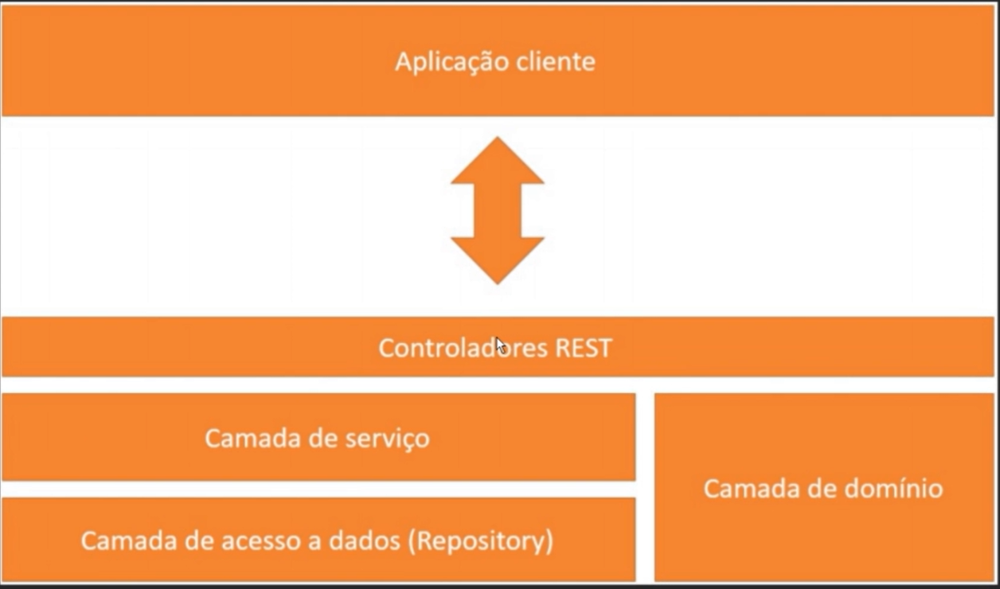

# Sistema Help Desk


## Iniciaremos o desenvolvimento pelos os Enums

**Em Java, uma enum é um tipo no qual declaramos um conjunto de valores constantes pré-definidos** . Sua sintaxe é muito semelhante à declaração de uma classe, exceto pelo uso da palavra chave **enum** que antecede seu nome.

- Classes enum e herança

  Ao declarar uma enum estamos implicitamente estendendo a classe **java.lang.Enum**. Isso cria algumas limitações, porque o Java não suporta herança múltipla, o que impede uma **classe enum** de estender outras classes. Porém, uma classe enum pode ter propriedades, assim como um construtor e métodos getters.
- **O construtor de uma enum é sempre privado** , não podendo ser invocado diretamente. Nele são iniciados todos os campos, que por serem constantes devem declarados antes das propriedades e do construtor da classe.
- Deve ser evitado criar setters para as propriedades de uma enum, pois isso vai de encontro com sua caracterísitca imutável.
- Métodos herdados de Enum

  Um dos mais utilizados dentre eles é **values()**, que retorna um array contendo todos os campos da enum.

  No exemplo a seguir imprimimos a descrição de cada um dos campos da enum Turno:

  for (Turno t : Turno.values()) {

System.out.println(t.getDescricao());
}


## Criação da classe Pessoa


A classe Pessoa é herdada pela classe Cliente e Tecnico. A classe Pessao será abstrata , não poderemos criar instancia de Pessoa e sim de Tecnico e Cliente( verificar UML no inicio do projeto), não teremos objetos de Pessoa. Quando quisermos criar um usuario ele será um cliente ou um técnico.

```
public abstract class Pessoa {
}

```

Os atributos da classe Pessoa não podem ser private , eleas deverão ser protected, quando os atributos forem privates isso significa que só a classe Pessoa terá acesso aos atributos, por isso utilizaremos protected, protected todas as classes filhas de Pessoa como tecnico e Cliente terão acesso.

## Implements "Serializable"

Serializable Serve para seja criado uma sequencia de bytes das instancias da nossa classe para que possam ser trafegados em rede,
podem ser armazenados em arquivos de memória, pode ser descerealizados e recuperadas em memória posteriormente

## Padrão de camadas



Nós temos a nossa aplicação cliente que fará uma requisição ao back end. A camada do backEnd  que vai receber o primeiro 
contato da nossa aplicação cliente é a camada de controladores/camada REST/resources ela se comunica com a camada de serviços que é onde fica 
implementado as nossas lógicas de negócios, que tem contato com a camada de acesso a dados que são os repositorys, 
e os repositorys vão servir para fazer a persistencia das informações no nosso banco. 


## implements CommandLineRunner

O CommandLineRunner ele tem um método run, e ele roda toda vez que eu startar a aplicação.

## Referencias

- https://www.devmedia.com.br/enums-no-java/38764
- https://wpsilva.medium.com/utilizando-banco-de-dados-h2-com-spring-de-forma-r%C3%A1pida-e-simples-6d896e15a4af
